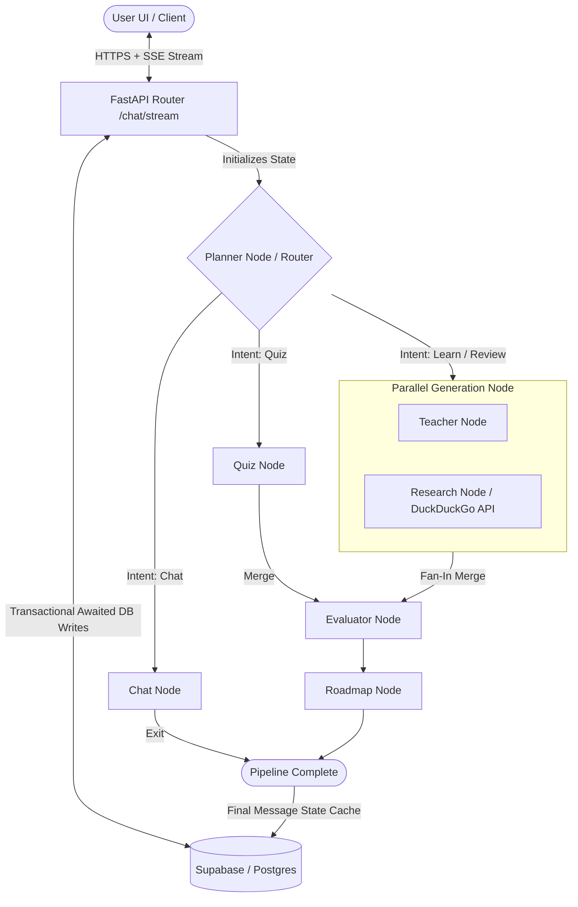

# Synapse: Enterprise Multi-Agent Learning & Adaptive Curriculum Platform

Synapse is a state-of-the-art, adaptive learning platform designed to dynamically construct personalized learning paths, quizzes, visual diagrams, and real-time explanations. The platform is powered by a stateful multi-agent orchestrator utilizing **LangGraph**, built on top of **FastAPI** (Backend) and **React Vite** (Frontend), with **Supabase (PostgreSQL)** managing the persistence layer.

---

## 🏗️ Core Architecture & Innovations

### 1. Stateful Multi-Agent Orchestration (LangGraph)
Unlike standard single-prompt LLM wrappers, Synapse leverages a cyclical, state-driven workflow graph. A designated **Planner Agent** acts as an intelligent router, inspecting the incoming query to evaluate user intent, skill levels, and difficulty. The graph then branches dynamically:
* **Casual Chat Workflow:** Routed immediately to the `chat` node for zero-latency conversational responses.
* **Curriculum Building Workflow:** Employs parallel execution (**Fan-Out/Fan-In** pattern) where the `teacher` node generates detailed structured explanations, and the `research` node concurrently performs live web queries via DuckDuckGo Search.
* **Assessment Workflow:** Executes the `quiz` node to generate adaptive difficulty questions.
* **Joining & Output Generation:** All parallel operations merge back into the `evaluator` and `roadmap` nodes, generating performance feedback and progressive learning schedules.

### 2. Event-Driven SSE Streaming Engine
To solve high latency issues typical of complex LLM graph pipelines (~15-30s execution time), Synapse utilizes **Server-Sent Events (SSE)**.
* As individual nodes in the LangGraph finish execution, their state delta is serialized and immediately pushed down to the client via FastAPI's `StreamingResponse`.
* The React client receives these events progressively, updating specific sections of the UI (e.g., rendering the explanation, then the quiz result cards, then resources) in real-time, reducing perceived load times to < 1 second.

### 3. Resilient Database Persistence
To prevent database connection failures and enforce relational integrity:
* User profiles are lazily instantiated in Supabase during the first interaction to fulfill foreign key constraints on dependent child tables (`learning_sessions` and `session_messages`).
* Sequential writes are strictly managed via Python's thread-pool mapping to guarantee that a parent session exists in Supabase before child messages are committed.

---

## 🗺️ System Design



---

## 📂 Folder Structure

```text
Synapse/
├── backend/                       # Python FastAPI Backend
│   ├── app/
│   │   ├── agents/                # LangGraph Agent Configurations
│   │   │   ├── graph.py           # Core graph topology & conditional routing
│   │   │   ├── nodes.py           # State generator functions (LLM nodes)
│   │   │   └── state.py           # Typed schema for the shared agent state
│   │   ├── core/                  # Core configurations, database, and dependencies
│   │   │   ├── config.py          # Pydantic environment configurations
│   │   │   ├── database.py        # Supabase client instantiation
│   │   │   └── security.py        # Encryption & Authentication modules
│   │   ├── prompts/               # System prompts segregated by node functions
│   │   ├── routers/               # FastAPI routing layers (chat, auth, users, etc.)
│   │   ├── schemas/               # Pydantic input/output validation schemas
│   │   └── services/              # Business logic services (Supabase & LLM wrappers)
│   ├── requirements.txt           # Python dependency manifest
│   └── uvicorn.log                # Active backend execution logs
│
├── frontend/                      # React TypeScript Frontend (Vite)
│   ├── src/
│   │   ├── app/
│   │   │   ├── components/        # Isolated modular UI components
│   │   │   │   ├── ClaudeChat.tsx # Main conversational client & streaming receiver
│   │   │   │   ├── ClaudeSidebar.tsx # Chat History sidebar component
│   │   │   │   └── Sidebar.tsx    # Layout and navigation wrappers
│   │   │   └── App.tsx            # Application routers & global state handlers
│   │   ├── styles/                # Tailwind & design token utility variables
│   │   └── main.tsx               # Client entry point
│   ├── vite.config.ts             # Vite configuration with proxy specifications
│   └── package.json               # Node.js dependencies & scripts
```

---

## ⚙️ Installation & Operation

### Prerequisites
* **Python**: 3.10 or higher
* **Node.js**: v18.0.0 or higher
* **Supabase**: Active instance with `app_users`, `learning_sessions`, and `session_messages` tables.

---

### 1. Backend Setup

Navigate to the `backend/` directory, create a virtual environment, and install dependencies:

```bash
cd backend
python -m venv venv
venv\Scripts\activate       # On Windows (PowerShell: venv\Scripts\Activate.ps1)
source venv/bin/activate    # On macOS/Linux
pip install -r requirements.txt
```

Create a `.env` configuration file inside `backend/`:

```env
COHERE_API_KEY="your-cohere-api-key"
SUPABASE_URL="your-supabase-url"
SUPABASE_KEY="your-supabase-service-role-key"
```

Start the FastAPI application:

```bash
python -m uvicorn app.main:app --host 127.0.0.1 --port 8000 --reload
```

---

### 2. Frontend Setup

Navigate to the `frontend/` directory and install the Node modules:

```bash
cd ../frontend
npm install
```

Start the Vite dev server (it will run on port `3000` and proxy `/chat` requests automatically to the backend on port `8000`):

```bash
npm run dev
```

Open `http://localhost:3000` in your web browser.

---

## 🔌 API Documentation Reference

### `POST /chat/stream`
Initiates the SSE stream parser.
* **Headers:** `Content-Type: application/json`
* **Request Body:**
  ```json
  {
    "user_id": "uuid-string-of-user",
    "session_id": "optional-uuid-of-existing-chat",
    "message": "Explain React state management"
  }
  ```
* **Response Event Stream Examples:**
  ```text
  data: {"node": "planner", "session_id": "xyz", "topic": "React State Management"}
  data: {"node": "teacher", "explanation": "... progressive text generated by LLM ..."}
  data: [DONE]
  ```

### `GET /chat/sessions/{user_id}`
Returns all active and archived learning paths associated with a user, sorted chronologically (`newest first`).
